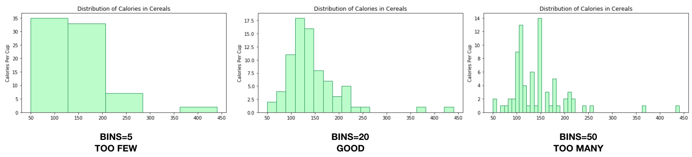

# Displaying Distributions

This repository was used to build out the data for a [blog post](https://medium.com/nightingale/plotting-a-quantitative-variable-in-your-dataset-526c26d40dc7) discussing methods to show the distribution of calorie contents in various cereals - as well as how calorie content relates to shelf placement, manufacturer, and fiber content. It utilizes the [80-cereals Kaggle dataset](https://www.kaggle.com/crawford/80-cereals) to show how to use each graph. 

If you go to the blog link, you can also see cartoons meant to personify these graphs. 

